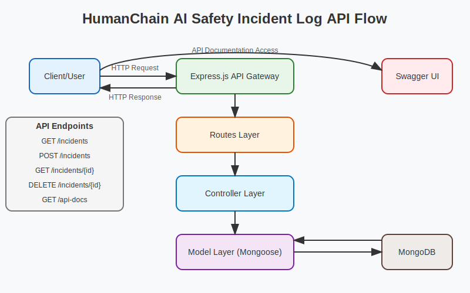

# AI Safety Incident Log API

A RESTful API service for logging and managing AI safety incidents.

### Deployed API Documentation
      Change SERVER from Development to Production at live link
- Access the live API documentation at: https://humainchain-1.onrender.com/api-docs/

## Architecture



The API follows a layered architecture pattern:

1. **API Gateway (Express.js)**: 
   - Handles incoming HTTP requests
   - Routes requests to appropriate endpoints
   - Provides API documentation access via Swagger UI

2. **Routes Layer**:
   - Defines available API endpoints
   - Manages request routing to controllers
   - Implements basic request validation

3. **Controller Layer**:
   - Processes incoming requests
   - Implements business logic
   - Manages response handling

4. **Model Layer (Mongoose)**:
   - Defines data schemas
   - Handles database operations
   - Provides data validation

5. **Database (MongoDB)**:
   - Stores incident data
   - Provides persistent data storage

### Available Endpoints

- `GET /incidents` - Retrieve all incidents
- `POST /incidents` - Create new incident
- `GET /incidents/{id}` - Retrieve specific incident
- `DELETE /incidents/{id}` - Delete specific incident
- `GET /api-docs` - Access API documentation

## Tech Stack

- Node.js
- TypeScript
- Express
- MongoDB with Mongoose ODM
- Swagger/OpenAPI for API documentation

## Prerequisites

- Node.js (v14 or higher)
- MongoDB (running locally or accessible MongoDB instance)

## Setup

1. Clone the repository

2. Install dependencies:
   ```bash
   npm install
   ```

3. Create a `.env` file in the root directory with the following content:
   ```
   PORT=3000
   MONGODB_URI=mongodb://localhost:27017/ai_safety_incidents
   ```

4. Build the TypeScript code:
   ```bash
   npm run build
   ```

5. Seed the database with sample incidents (optional):
   ```bash
   npx ts-node src/scripts/seedData.ts
   ```

## API Documentation with Swagger

The API is documented using OpenAPI/Swagger specification. You can access and interact with the API in multiple ways:

### Interactive Swagger UI
1. Start the server:
   ```bash
   npm run dev
   ```
2. Visit `http://localhost:3000/api-docs` in your browser
3. You'll see the interactive Swagger UI where you can:
   - View all available endpoints
   - Test API calls directly from the browser
   - See request/response schemas
   - Try out different parameters

### Swagger JSON
- Access the raw Swagger documentation at `http://localhost:3000/api-docs.json`
- Generate updated documentation anytime with:
  ```bash
  npm run generate-docs
  ```
- Find the generated documentation in `swagger.json` at the project root

### Documentation Features
- Complete API endpoint descriptions
- Request/response schemas
- Authentication requirements (if any)
- Example requests and responses
- Error responses
- Input validation rules

### Using Swagger UI
1. **Exploring Endpoints**:
   - Endpoints are grouped by tags (Incidents)
   - Click on any endpoint to expand details
   - See full request/response schemas

2. **Testing Endpoints**:
   - Click "Try it out" on any endpoint
   - Fill in required parameters
   - Execute requests directly from the UI
   - See full response details

3. **Error Responses**:
   - Each endpoint shows possible error responses
   - Includes error codes and response formats
   - Test validation by sending invalid data

## Running the Application

Development mode (with hot reload):
```bash
npm run dev
```

Production mode:
```bash
npm start
```

## API Documentation

### 1. GET /incidents
Retrieves all incidents from the database.

```bash
curl -X GET http://localhost:3000/incidents
```

Response (200 OK):
```json
[
  {
    "id": "1234...",
    "title": "AI Model Bias Detection",
    "description": "Detected significant bias in AI model outputs...",
    "severity": "High",
    "reported_at": "2024-02-01T00:00:00.000Z"
  }
]
```

### 2. POST /incidents
Creates a new incident.

```bash
curl -X POST http://localhost:3000/incidents \
  -H "Content-Type: application/json" \
  -d '{
    "title": "New Incident",
    "description": "Detailed description here",
    "severity": "Medium"
  }'
```

Response (201 Created):
```json
{
  "id": "5678...",
  "title": "New Incident",
  "description": "Detailed description here",
  "severity": "Medium",
  "reported_at": "2024-03-20T12:00:00.000Z"
}
```

Validation:
- Required fields: title, description, severity
- Severity must be one of: "Low", "Medium", "High"
- Missing/invalid fields return 400 Bad Request

### 3. GET /incidents/{id}
Retrieves a specific incident by ID.

```bash
curl -X GET http://localhost:3000/incidents/5678...
```

Response (200 OK):
```json
{
  "id": "5678...",
  "title": "New Incident",
  "description": "Detailed description here",
  "severity": "Medium",
  "reported_at": "2024-03-20T12:00:00.000Z"
}
```

### 4. DELETE /incidents/{id}
Deletes a specific incident.

```bash
curl -X DELETE http://localhost:3000/incidents/5678...
```

Response: 204 No Content on success, 404 Not Found if incident doesn't exist

## Error Handling

The API implements comprehensive error handling:

- 400 Bad Request: Invalid input data
- 404 Not Found: Resource not found
- 500 Server Error: Database or server issues

Error responses include descriptive messages:
```json
{
  "message": "Error description here"
}
```

## Design Decisions

1. **Database Choice**: MongoDB was chosen for:
   - Flexible schema for future extensions
   - Built-in support for JSON data
   - Easy integration with Node.js/TypeScript

2. **TypeScript**: Used for:
   - Type safety
   - Better IDE support
   - Enhanced code maintainability

3. **Express.js**: Selected for:
   - Minimal boilerplate
   - Extensive middleware ecosystem
   - Easy routing and error handling

4. **Error Handling**: Implemented comprehensive error handling with appropriate HTTP status codes and descriptive messages.

5. **Validation**: Input validation ensures data integrity and provides clear error messages.

## Data Model

Incident Schema:
- id: Unique identifier (auto-generated)
- title: String (required)
- description: String (required)
- severity: String (enum: Low, Medium, High) (required)
- reported_at: Date (auto-generated) 